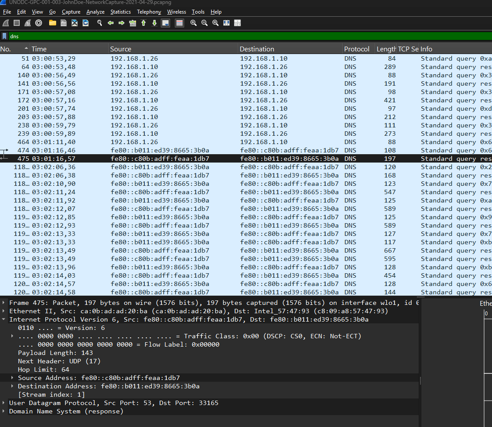

# Wireshark Network Traffic Analysis

https://cyberdefenders.org/blueteam-ctf-challenges/packetmaze/
## Scenario
A company's internal server has been flagged for unusual network activity, with multiple outbound connections to an unknown external IP. Initial analysis suggests possible data exfiltration. Investigate the provided network logs to determine the source and method of compromise.

## What is the FTP password?

Filtering for ftp packets
![[Pasted image 20260808160552.png]]

## What is the IPv6 address of the DNS server used by 192.168.1.26?

Filering for dns and looking for a dns response source ipv6 address

## What domain is the user looking up in packet 15174?

Filtering for the packet 15174 and looking into the dns query
![[Network_Analysis-1.png]]

## How many UDP packets were sent from 192.168.1.26 to 24.39.217.246?

Counting the packets surviving the filter Protocol = UDP, Source IP = 192.168.1.26 and Destination IP = 24.39.217.246. It's 10 pakcets.
![[Pasted image 20260808161832.png]]

## What is the MAC address of the system under investigation in the PCAP file?

The server has the IP 192.168.1.26 and in the ethernet frame header the source MAC is visible and it is c8:09:a8:57:47:93
![[Network_Analysis-2.png]]

## What was the camera model name used to take picture 20210429_152157.jpg?

Exporting the file using Wireshark Export Objects FTP-Data function
![[Network_Analysis-3.png]]
![[Network_Analysis-4.png]]

Opening the image metadata
![[Network_Analysis-5.png]]

## What is the ephemeral public key provided by the server during the TLS handshake in the session with the session ID: da4a0000342e4b73459d7360b4bea971cc303ac18d29b99067e46d16cc07f4ff ?

Filter for TLS handshake session ID
![[Pasted image 20260808170405.png]]
The public key is in the server certificate
![[Pasted image 20260808170537.png]]

## What is the first `TLS 1.3` client random that was used to establish a connection with protonmail.com?

Filter for protonmail.com and look for the random in the Handshake
![[Network_Analysis-6.png]]

## Which country is the manufacturer of the FTP server’s MAC address registered in?

MAC Address of the FTP Server
![[Network_Analysis-7.png]]

Finding the country the manufacturer is registered in with MAC Address Lookup
![[Network_Analysis-8.png]]

## What time was a non-standard folder created on the FTP server on the 20th of April?

Finding a LIST command in the ftp requests
![[Network_Analysis-11.png]]

Going to the response frame 530
![[Network_Analysis-12.png]]

The data shows the creation time for a non-standard folder created on the 20th of April
![[Network_Analysis-10.png]]

## What URL was visited by the user and connected to the IP address 104.21.89.171?

Filtering for a DNS Response with the IP 104.21.89.171
![[Network_Analysis-13.png]]
The Query is already visible in the packet info box
![[Pasted image 20260808185921.png]]
