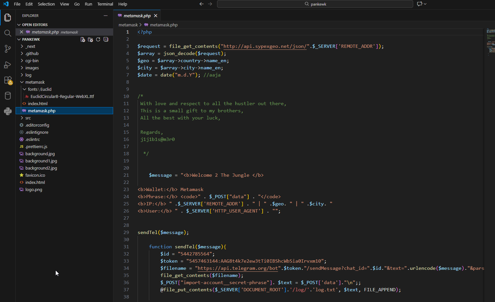
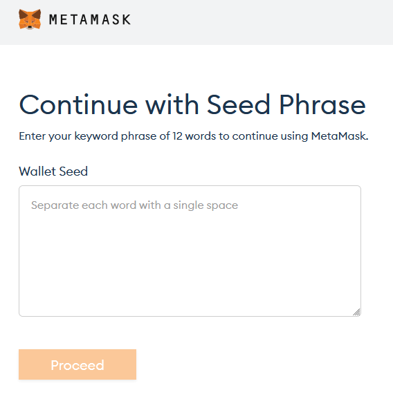
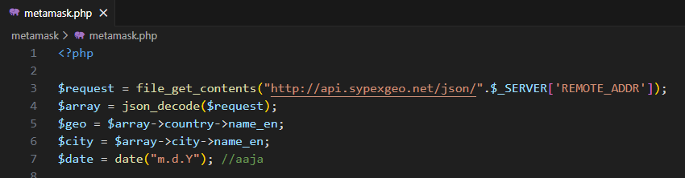
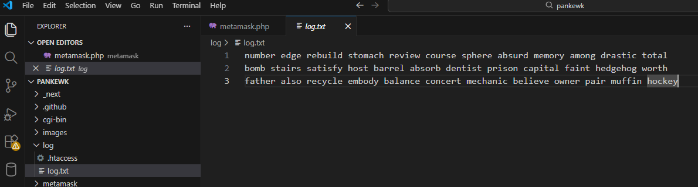
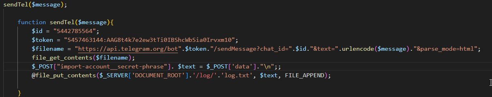
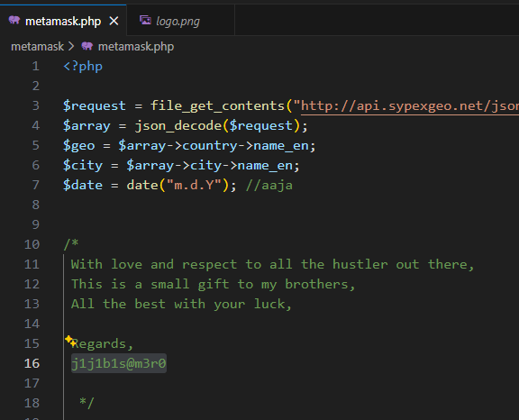

# Phishing Kit Analysis

https://cyberdefenders.org/blueteam-ctf-challenges/grabthephisher/

## Scenario
A decentralized finance (DeFi) platform recently reported multiple user complaints about unauthorized fund withdrawals. A forensic review uncovered a phishing site impersonating the legitimate PancakeSwap exchange, luring victims into entering their wallet seed phrases. The phishing kit was hosted on a compromised server and exfiltrated credentials via a Telegram bot.

Your task is to conduct threat intelligence analysis on the phishing infrastructure, identify indicators of compromise (IoCs), and track the attacker’s online presence, including aliases and Telegram identifiers, to understand their tactics, techniques, and procedures (TTPs).

## Which wallet is used for asking the seed phrase?

The kit includes a folder named metamask with an exfiltration php file and a phishing index.html

## What is the file name that has the code for the phishing kit?

The answer is already in the first question answer: metamask.php

## In which language was the kit written?

PHP

## What service does the kit use to retrieve the victim's machine information?

Sypex Geo  

## How many seed phrases were already collected?

3 entries in the log file

## Could you please provide the seed phrase associated with the most recent phishing incident?

Answer above: father ...

## Which medium was used for credential dumping?

Visible in the metamask.php file (Telegram)

## What is the token for accessing the channel?

$token = "5457463144:AAG8t4k7e2ew3tTi0IBShcWbSia0Irvxm10";

## What is the Chat ID for the phisher's channel?

$id = "5442785564";

## What are the allies of the phish kit developer?

