# SIEM QRadar  
Sometimes I had to use hints or when I was completely stuck, I had to use the walkthrough solutions.
## Scenario
A financial company was compromised, and they are looking for a security analyst to help them investigate the incident. The company suspects that an insider helped the attacker get into the network, but they have no evidence.
The initial analysis performed by the company's team showed that many systems were compromised. Also, alerts indicate the use of well known malicious tools in the network. As a SOC analyst, you are assigned to investigate the incident using QRadar SIEM and reconstruct the events carried out by the attacker.
**Dataset:**
- Sysmon - swift on security configuration
- Powershell logging
- Windows Eventlog
- Suricata IDS
- Zeek logs (conn, HTTP)

## Setup
Creating a virtual Network between the Host System and the VM (QRadar)
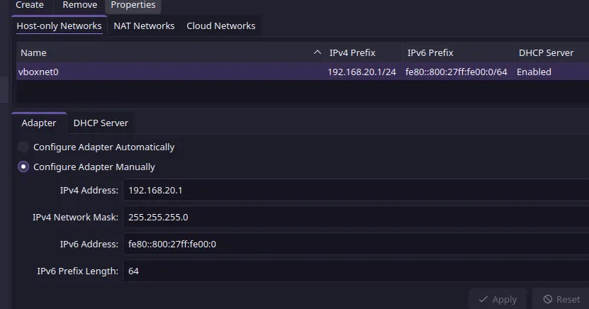
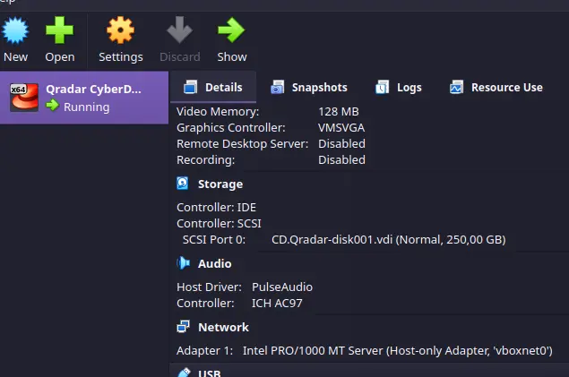

Then, launching the VM and accessing it via 192.168.20.21:443 and logging into QRadar
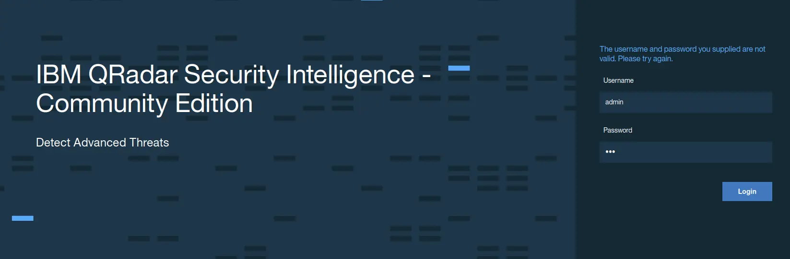

## How many log sources available?
Admin --> Log Sources
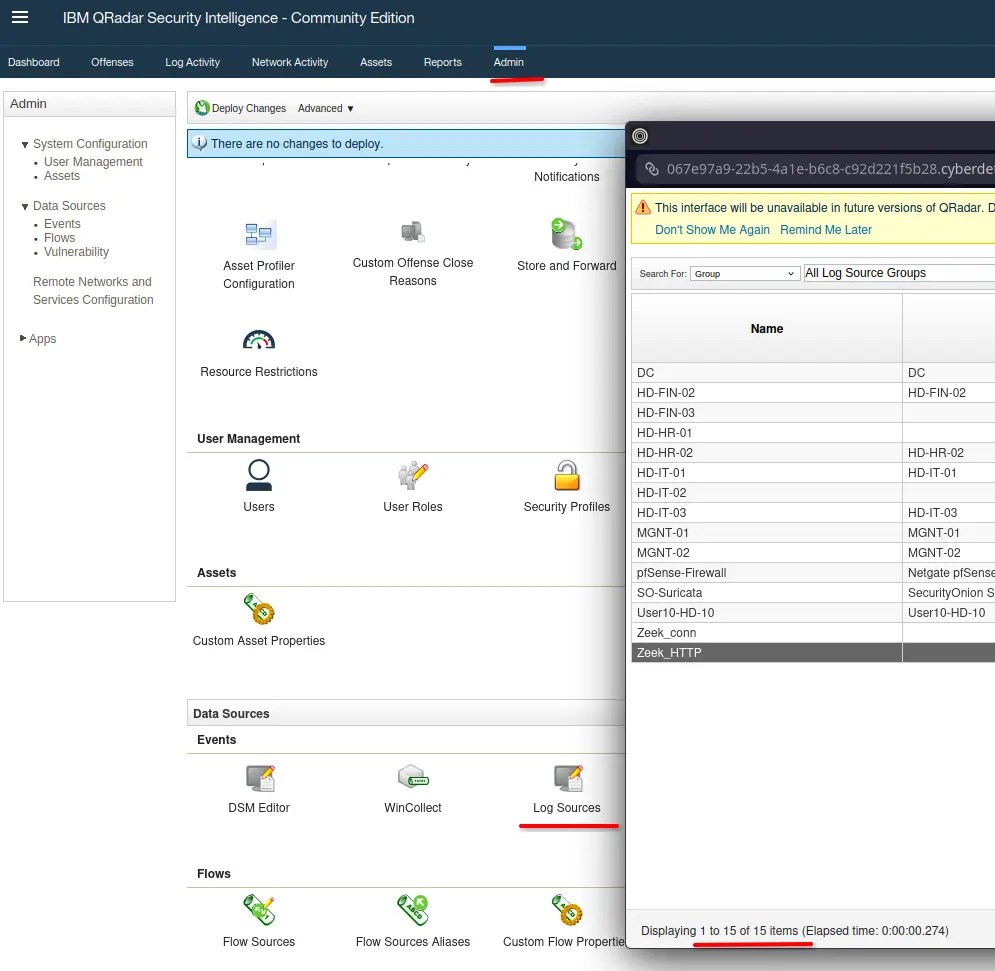

## What is the IDS software to monitor the network
Suricata is a IDS for network monitoring
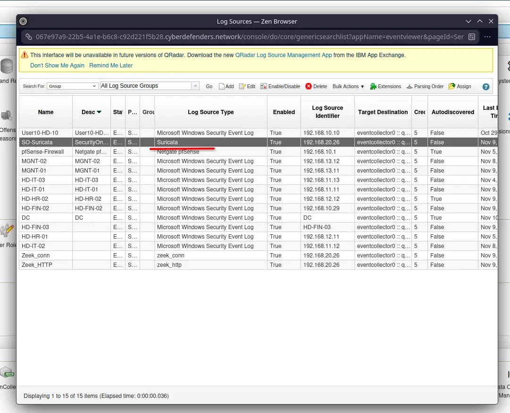

## What is the domain name used in the network?
Filtering by a local Source IP Address
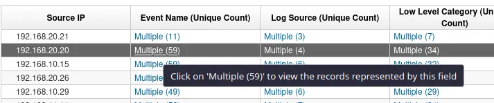

Filtering by an successful logon as an event name
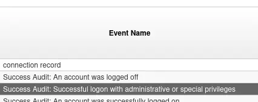

Inspecting the payload information of one. DC stands for Domain Controller
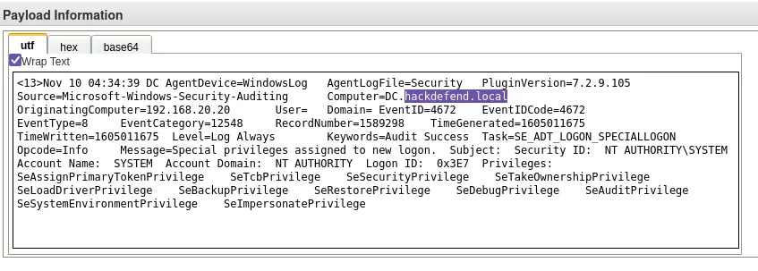

## Multiple IPs were communicating with the malicious server. One of them ends with "20". Provide the full IP.
The dashboard shows the top source addresses for offenses. You can find one that ends with .20
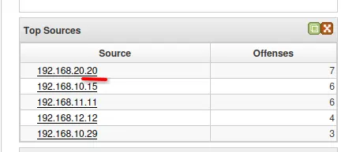

## What is the SID of the most frequent alert rule in the dataset?
Grouping the search results by the rule SID in the search edit menu
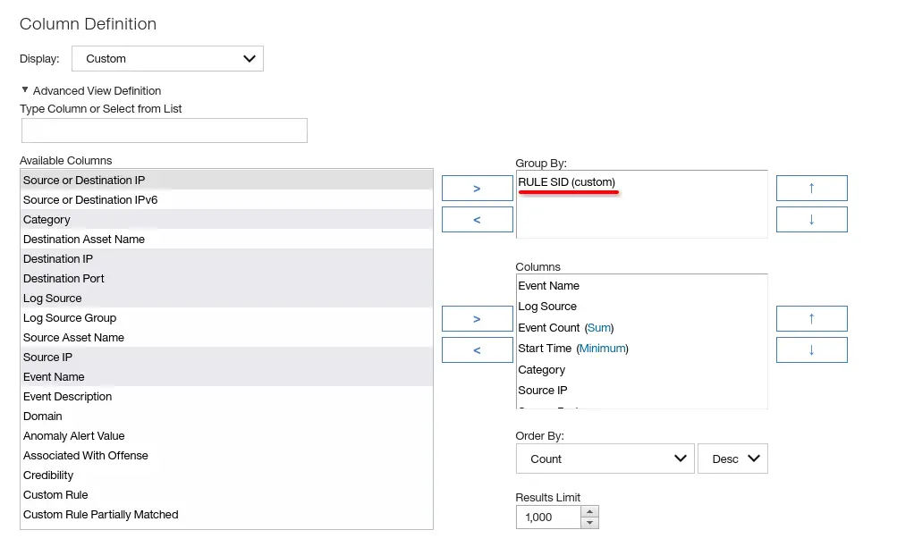
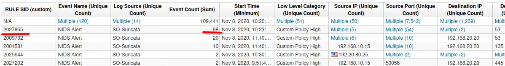

## What is the attacker's IP address?
Filter by rule SID is not N/A so you find the alert events
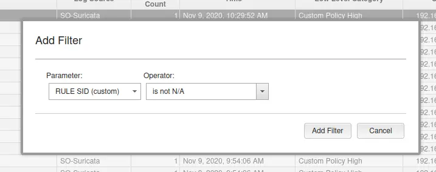

The most shown destination IP from the alters seems to be the attacker
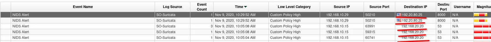

## The attacker was searching for data belonging to one of the company's projects, can you find the name of the project?
Filtering the logs for the regualr expression "project"

In one log you can find the name of the project
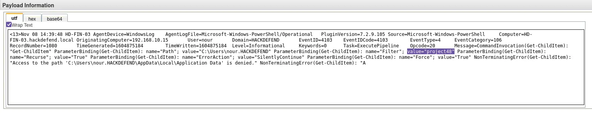

## What is the IP address of the first infected machine?
Was stuck on this question so I used to walkthrough solutions:

Its the IP of the PC which was searching for the project data
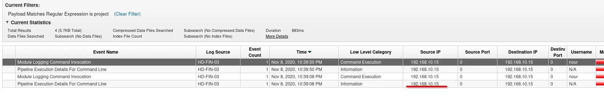

## What is the username of the infected employee using 192.168.10.15?
Filter by the IP address

Look for a login/logoff related event
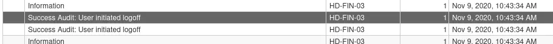

Inspect the payload information
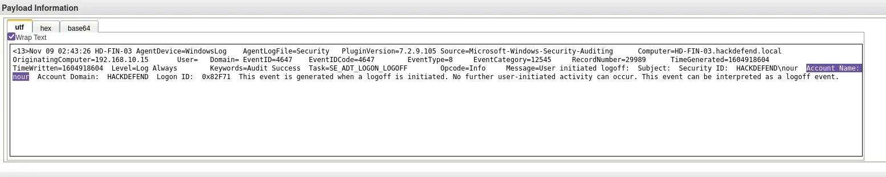

## Hackers do not like logging, what logging was the attacker checking to see if enabled?
Filter by username
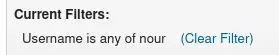

Logging invocation Event
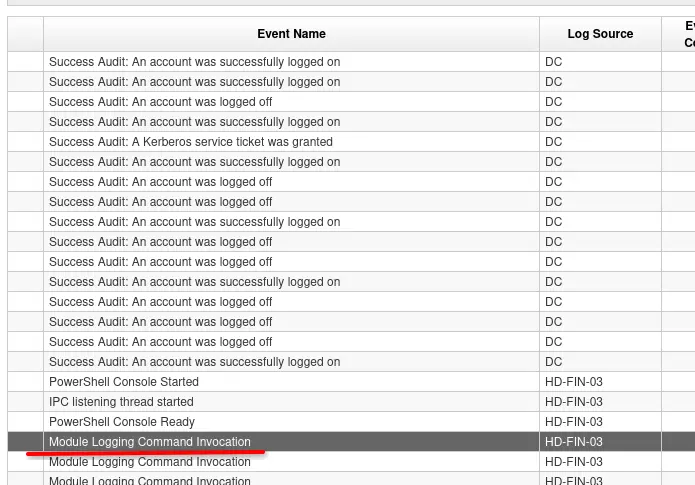

Event Description shows checked logging
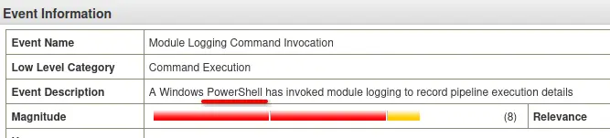

## Name of the second system the attacker targeted to cover up the employee?
Filtering for the "del" command in the cmd, because it commonly used for coverups
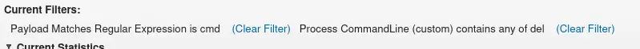

Two times a file was deleted
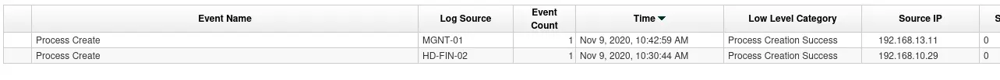

Only one system name fits the answer format
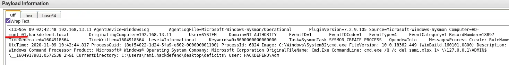

## When was the first malicious connection to the domain controller (log start time - hh:mm:ss)?
Filtering for a detected network connection
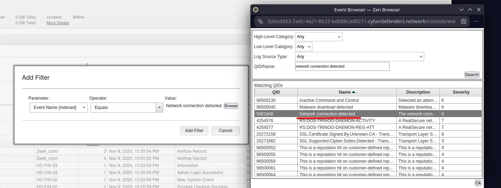

This connection seems suspicious because notepad.exe initiated the connection
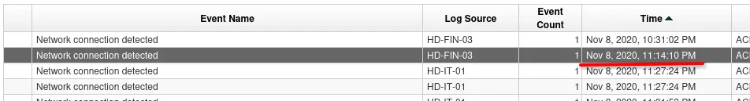

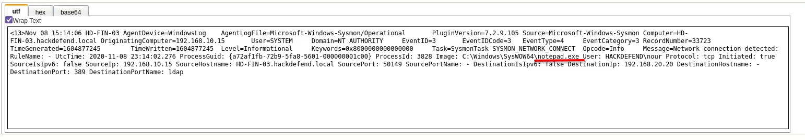

## What is the md5 hash of the malicious file?
Filter for MD5 Expression in the Log
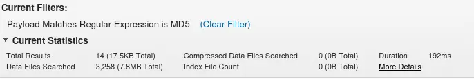

A hash created by the infected machine seems to be the hash of a malicious file
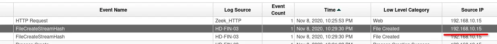

The payload shows the md5 hash
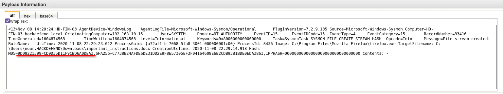

## What is the MITRE persistence technique ID used by the attacker?
I was stuck at this question so I used the walkthrough as help:

Filtering by a infecterd systems IP and grouping by Event Name to find possible persistence related event names
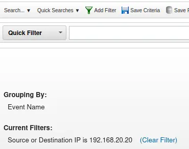

Regestry Key manipulation can be used for persistence initiation
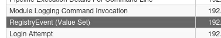

One Payload shows that a script was added to the Run Registry Key which is for auto start.
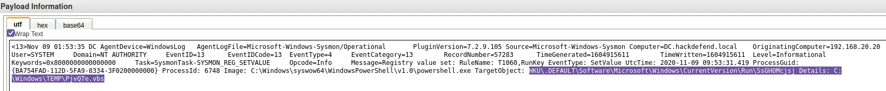

The MITRE ID for that is T1547.001

## What protocol is used to perform host discovery?
ICMP is typically used for network scanning, so I filtered by ICMP Protocol
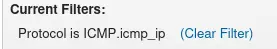

The infected system 192.168.10.15 used icmp packets 37 times
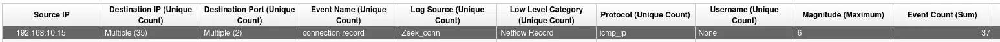

It used it on several local systems
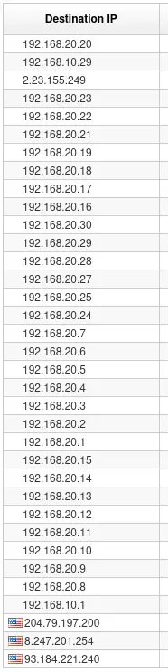

ICMP Type 8 stands for Echo Request
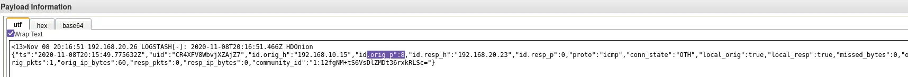

## What is the email service used by the company?
There are no standard smtp port traffic logs.
I was stuck so I checked the solutions:
Checking for the origin of outgoing IP addresses which is microsoft a lot of times, thats why the email service is supposed to be office365.

## What is the name of the malicious file used for the initial infection?
You can find the name in the payload inforamtion picture of the md5 question
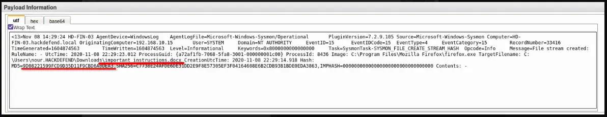

## What is the name of the new account added by the attacker?
Grouping all logs by event name and searching for events related to account creation
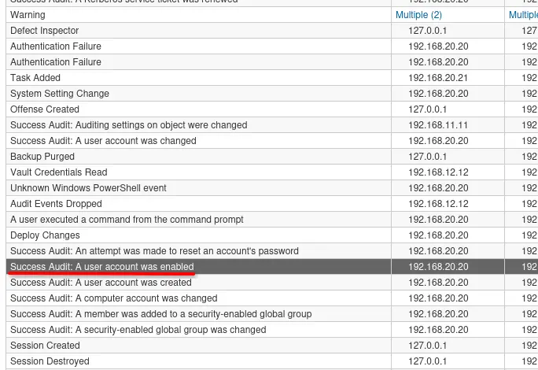

There is one log which creates an account
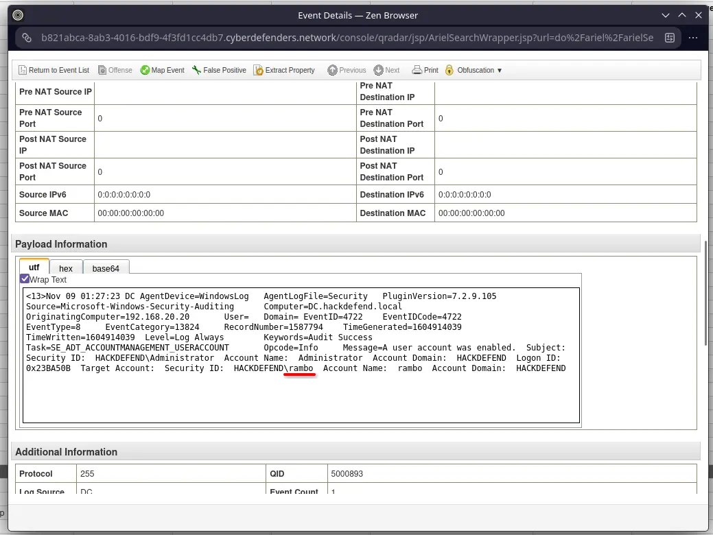

## What is the PID of the process that performed injection?
Was kind of stuck at this one as well so I used the solution as help as well
CreateRemoteThread is an event name of injection logs

The payload of a log indicates Injection due to a new process starting at a memory address without a starting module
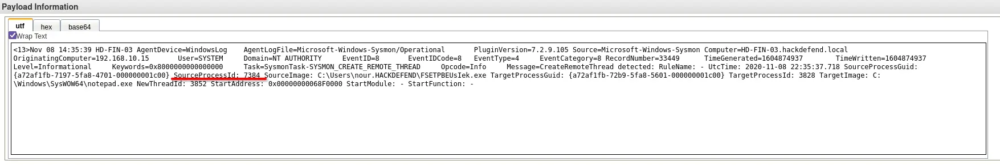

## What is the name of the tool used for lateral movement?
I didn't find anything in the logs and the the hints didnt help so I asked AI which tools are commonly used for lateral movement and so thats how I solved this question: wmiexec.py
After reviewing the solution I just learned how to view all CLI commands at once which would have been very useful.
## Attacker exfiltrated one file, what is the name of the tool used for exfiltration?
Searching through all executed commands to find one that is used for exfiltration
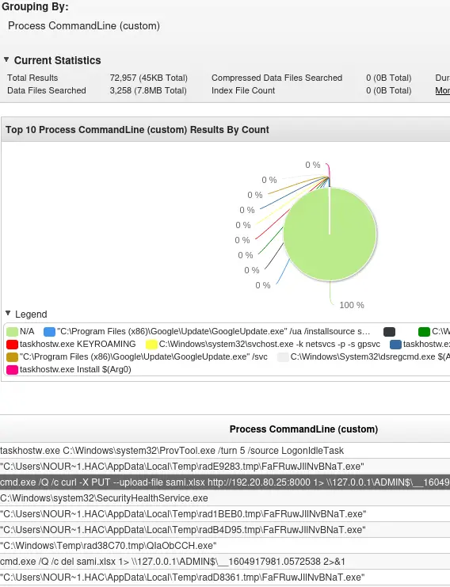

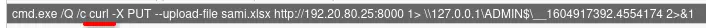

## Who is the other legitimate domain admin other than the administrator?
Filtering by "special" for the event "Success Audit: Successful logon with administrative or special privileges" which is common for admin behaviour and grouping by username
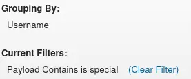
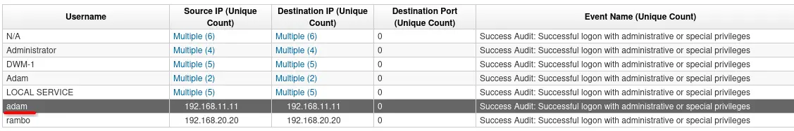
Rambo was added by the attacker
## The attacker used the host discovery technique to know how many hosts available in a certain network, what is the network the hacker scanned from the host IP 1 to 30?
Filtering for icmp protocol and the infected system 192.168.10.15
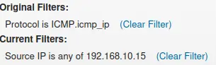

The destination IPs are in the subnet 192.168.20.0/24
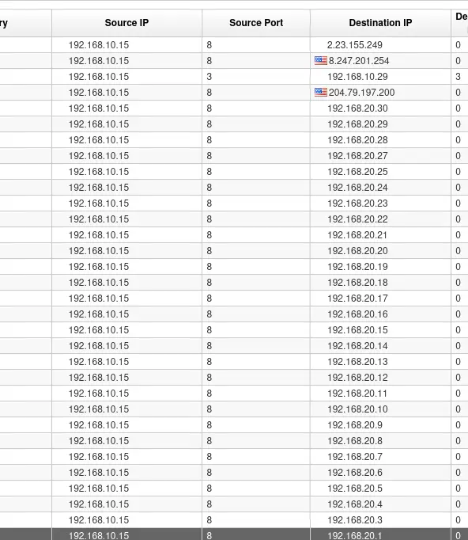

## What is the name of the employee who hired the attacker?
The exfiltrated file was named sami.xlsl. Thats why the employee name is supposed to be sami. It seems like sami was intrested in the data the organisation is saving about him 

