# File System FAT32

>A filesystem is the structure that an OS uses to organize, store and retrieve files and directories. It also includes the metadata of the files. FAT32 is not state of the art anymore because of the maximum filesize of 4GB.

## FAT32 Structure: Reserved and FAT Areas

### We have a hypothetical file B and its cluster chain starts at cluster F and ends at cluster 10 . What would be the value of the FAT entry at cluster F?

Bytes per sector are saved in the bootsector. 00 02 in big endian equals 512
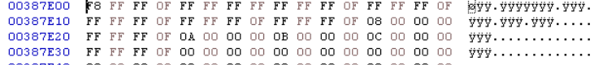

One Sector per Cluster

Reserved Sectors equals 6270 in decimal (big endian)
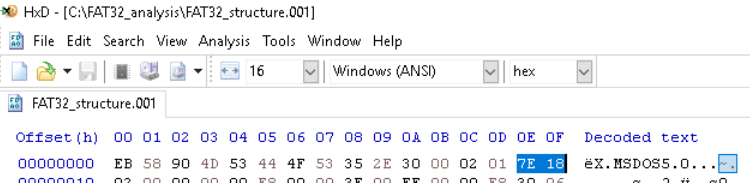

Number of FATs is 2
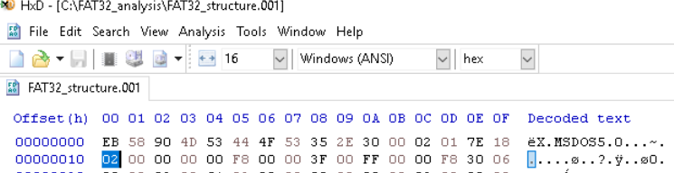

FAT starts at 6270 * 512 (Reserved Sectors * Bytes per Sector) = 3.210.240 = 0x30FC00

Start of the FAT
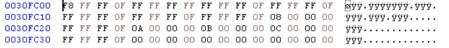

Adding the Cluster F Offset 0x30FC00 + 0xF *4 (Cluster F * 4 bytes) = 0x30FC3C 

Apperently the task doesn't want you to find it in the image. You are just supposed to caculate it:
Cluster F stores the value of the next cluster which is 10. Each cluster is 4 bytes long so in little endian it is 10 00 00 00.

### At which offset does the FAT2 table start?

Sectors per FAT
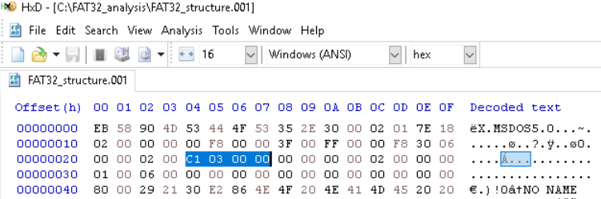

Start of FAT2 = Reserved Sectors + Sectors per FAT (for the first FAT) = 7231 Sectors --> Offset 3702272 = 0x387E00

## FAT32 Structure: Data Area

### What is the filename of the file that starts at cluster 9?

Already found:
Bytes per Sector = 512
Reserved Sectors = 6270
Sectors per FAT = 961
Number of FATs = 2
FAT1 starts at 0x30FC00
FAT2 starts at (6270 + 961) * 512 = 0x387E00

Data Area/Root Directory starts at (6270 + 961 + 961) * 512 = 0x400000

Every Directory Entry shows the first cluster number in the 5th and 6th last byte.
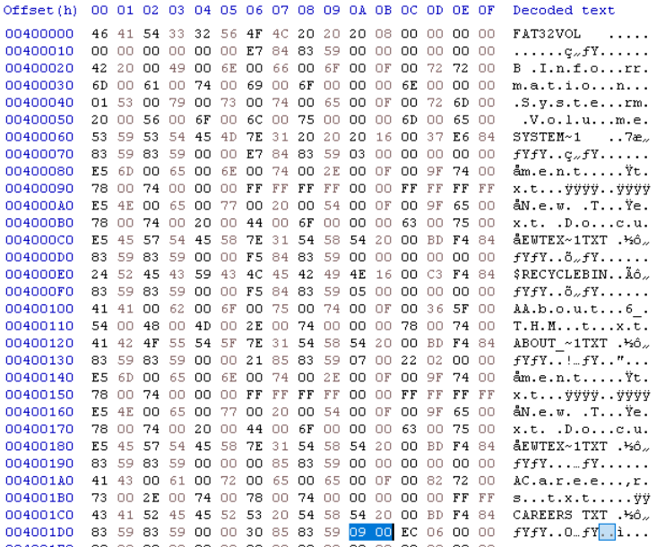

So the name of the filename is careers.txt

### What is the creation time of the file that starts at cluster 9?

These bytes show the creation time
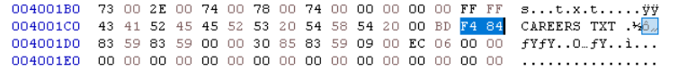

In big endian it is 84F4 --> 4:39:40 PM

## Hidden Files and Directories

### What is the short file name of the hidden file in the M@lL0v3 directory?

BEMYVA~1
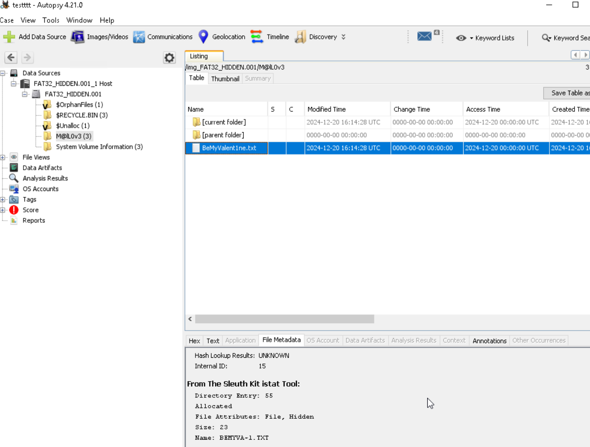

### What is the flag found during automated analysis?

THM{F0uNdTh3H!Dd3nF1l3}
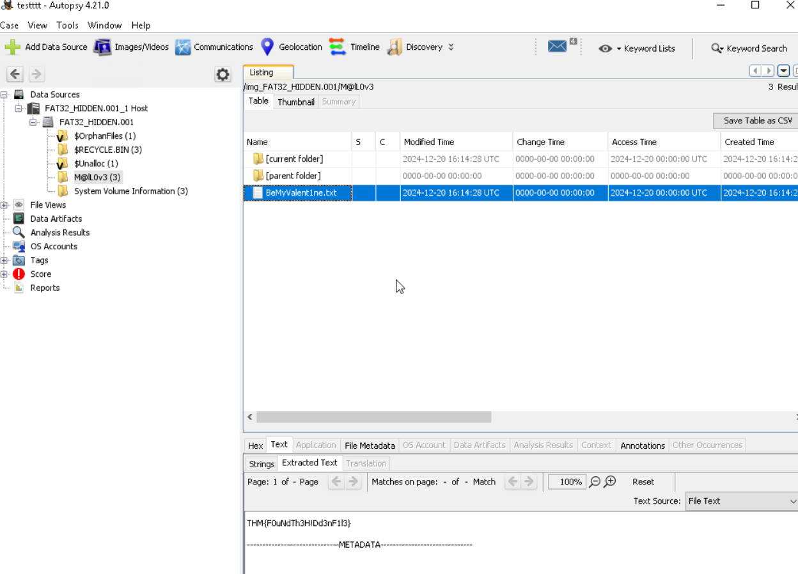

## Timestomp

### What is the Accessed timestamp of the discovered suspicious file?

Using the Timeline feature of Autopsy
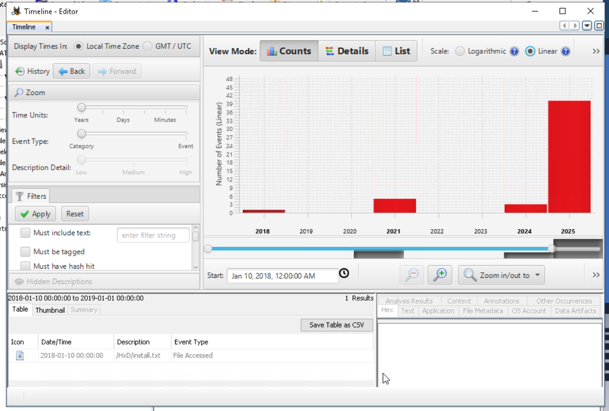
2018-01-10 00:00:00

### What is the flag found during the automated analysis?

Text found in the of the file
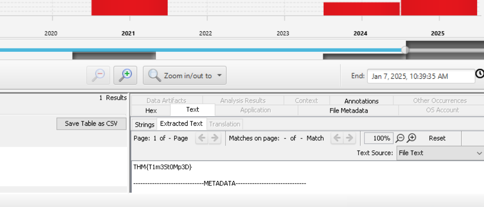
THM{T1m3St0Mp3D}

## File Deletion and Clear Persistence
What is the output of the deleted PowerShell script after executing it?

The deleted File
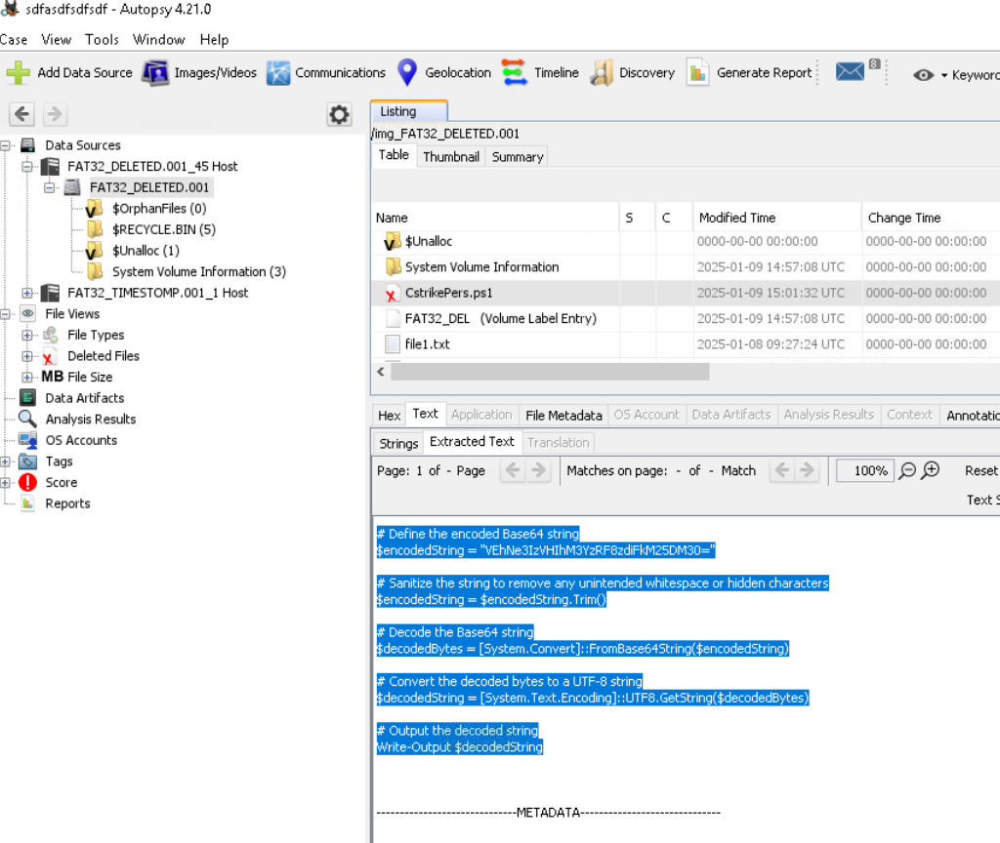

Script output is THM{r3Tr!3v3D_3v!d3nC3}
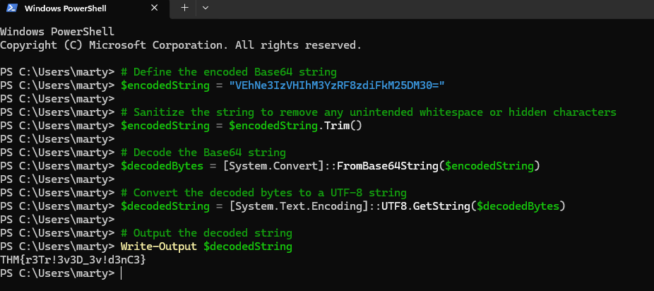

